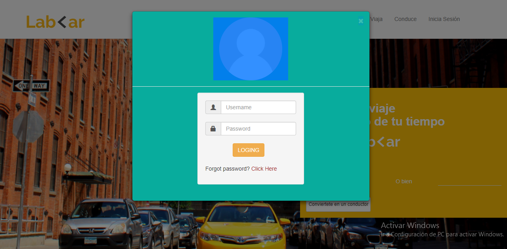

# **Lab-<ar Challenge**

* **Track:** _Common Core_
* **Curso:** _Crea tu propia red social_
* **Unidad:** _No reinventes la rueda_

***

## Objetivo

El reto consiste en replicar la página web [**Lab-<ar**](https://github.com/Laboratoria-learning/lab-car-boilerplate), en su versión web y móvil, usando **`BOOTSTRAP`**. Como extra añadir los modales necesarios en la versión web. 

* **Versión Web**

* **Versión Móvil**

* **Modales `(Modal Inicia Sesión)`**

* **Modales `(Modal Regístrate)`**

* **Modales `(Modal Convierte en conductor)`**

## Contenido del Repositorio

* Contiene una carpeta en el cual hay un archivo base `index.html` (estructura del proyecto y enlaces CSS y JS). En adición, está el `README.md` que contiene la explicación de este proyecto. Y el pluggin `eslintrc` (ayuda con la validación de la sintaxis del proyecto).

* En la carpeta `assets` se encuentran las carpetas `documents`  (documentación del proyecto) e `images` (imágenes del proyecto).

* En la carpeta `css` hay un archivo base `main.css` (estilos del proyecto).

* En la carpeta `js` hay un archivo base `app.js` (códigos del  proyecto).

### Otras consideraciones

* La paleta de colores usadas: `#56ccf2`, `#2f80ed`.

* Conocimientos técnicos: BOOTSTRAP, etc.

## Herramientas

* VISUAL STUDIO CODE.

## Nota

* El sitio original tiene ciertos efectos y funcionalidades que están fuera del alcance para este reto. Pero se ha tratado de replicar lo más cercano posible con los conocimientos adquiridos en clase.

## Resultado

[Resultado del Proyecto.](#)